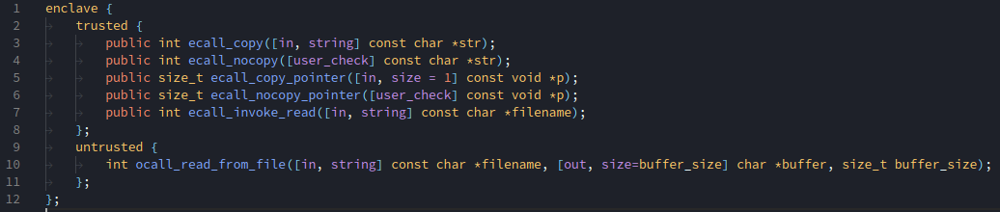

# VSCode Secure Guard Extension

The aim of this package is to add SGX specific functions in VSCode. **This doesn't make VSCode any more secure!**

## Features

- Partial language support for EDL source files

## Roadmap

- Highlight EDL source code
- Complete in C/C++ code
